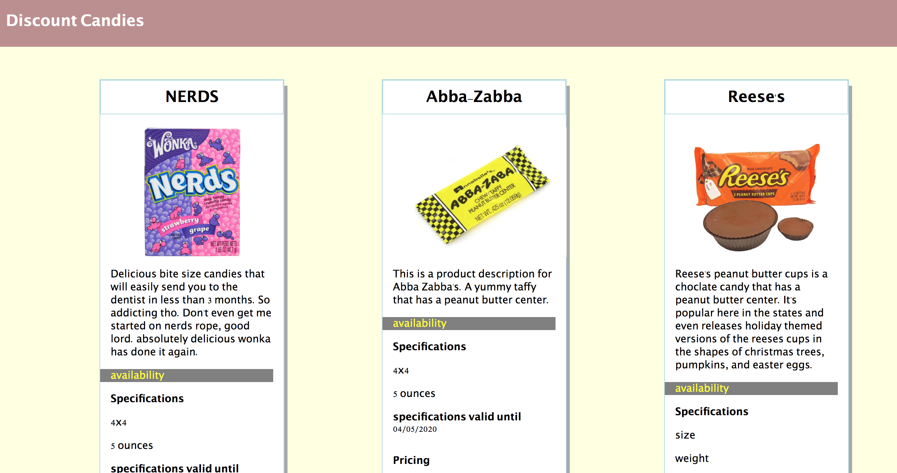

# product-cards

## Description

This project show cases the use of Flexbox,html and css stylings. It is designed to show candies and their pricings.

## Feature List
- 4 cards are displayed on the page

- Each card lists details about their respective candies.

## Screenshots

## How to Run

- Clone down this repo

- Make sure you have http-server installed via npm. If not get it HERE](https://www.npmjs.com/package/http-server).

- On your command line run `hs -p 9999`

- In your browser go to `http://localhost:9999`

## Contributors

[Zac Crumpton](https://github.com/ZacCrumpton)

